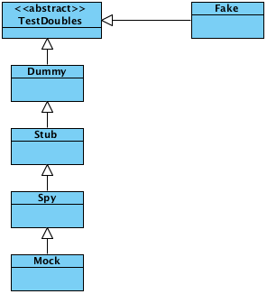
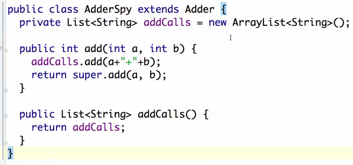

# Episode 23. Mocking Part 1
## Overview
mocking library를 자주 사용하지 않는다고 함.
## Boundaries and Mocks

- user가 login하면 controller가 user name과 password를 간단한 DS(LoginRequest)에 담아서 LoginInteractor에 전달한다.
- LoginInteractor는 user name과 password를 가지고 authorizer를 통해 확인한다.
- Authorizer가 user를 accept하면 Authorizer는 valid user id를 반환한다.
- LoginInteractor는 UserGateway를 사용해서 User 비즈니즈 객체를 fetch하고, 마지막 로그인 시간, 로그인 횟수 등을 얻는다.
- LoginInteractor는 이러한 데이터를 또 다른 단순한 DS(LoginResponse)를 통해 LoginPresenter에 전달한다.
- LoginPresenter는 화면에 보일 데이터를 준비한다.

### LoginInteractor에 대한 자동화 테스트를 어떻게 만들 것인가 ?
DB를 사용하면 테스트가 느려진다. Mocking을 이용하면 해소된다. decoupled되어 있어서 적용하기 쉽다.

테스트에서 개별적으로 원하는 결과를 반환하도록 하기 위해 stub을 생성한다.

- UserId(1)을 반환하는 StubAuthorizer
- InvalidUserID를 반환하는 RejectingAuthorizerStub

등을 만들어 놓고 테스트 케이스마다 적절한 구현체를 사용하면 된다.

`LoginInteractorImpl`에 setAuthorizer, setUserGateway는 있고, 이들에 대한 stub이 필요하지만 presenter는 다르다고 한다. presenter에 대해서는 적절한 시기에 적절한 메소드가 호출되었는지만 확인하면 된다. - interactor의 presenter에 대한 relationship을 spy하기 원한다.

- stub은 원하는 결과를 반환하도록 설정 가능
- spy는 추가적으로 어떤 인자를 전달받았는지를 저장했다가 전달받은 인자를 assert할 수 있음.

## Test Doubles

## The Dummy
interface에 있는 모든 메소드의 구현을 제공. do nothing하는...

DummySession
- Session은 생성하기 어려운 객체이다.
- reportDate가 invalid한 경우 session은 사용되지도 않는다.
- DummySession을 이용한다(모든 method에서 `return null`)
- 이런 경우 Dummy가 효율적이다.

Dummy는 테스트 더블의 일종으로 어떤 액션도 취하지 않는 함수들로 이뤄진다.

## The Stub
stub은 dummy의 일종이나 null, 0을 반환하는 대신 테스트에서 기대한 값을 반환한다.

stub은 dummy이다. 함수에서 어떤 일도 하지 않는다. 하지만 0이나 null 대신 어떤 요구되는 고정된 특별한 값을 반환한다. 아무것도 하지 않지만 당신이 원하는 값을 반환한다.

## The Spy
spy는 stub이다. spy는 어떤 인자가 전달되었는지 `watch`하고 `remember`한다.

- 어떤 함수가 호출되었는지
- 그 함수가 언제 호출되었는지
- 몇번이나 호출되었는지
- 어떤 인자가 전달되었는지

를 알려줄 수 있다.

## The Mock
추가적으로 어떤 일이 일어나야 하는지를 아는 Spy이다.

## The Fake
Fake는 Simulator이다.

fake가 많아지면 복잡해지고 유지보수하기 어려워진다. Test에서 필요한 fake만 작성하도록 한다.

**avoid fakes when you can**

# Episode 23. Mocking Part 2

## Behavior vs State

32bit x 32bit에 대한 테스트를 어떻게 추가할 것인가 ? 64bit의 조합을 다 조사해야 하는가 ? 엄청난 시간이 소요될 것이다.

**spy on the algorithm**

3 x 4 = 12에 대해서 3+3+3+3=12로 계산되므로 add가 3을 인자로 4번 호출되었는지를 확인하면 된다.

---

---

---

---

mock 기반 테스트는 DIP 적용되었을 때 적합. 하지만 Test가 구현에 종속된다는 문제가 발생.

따라서 적합한 방법을 택해야한다.

## Mocking Pattern

### Test Specific Subclass

subclass & override와 유사한 개념인듯

### Self Shunt

### Humble Object

21:08