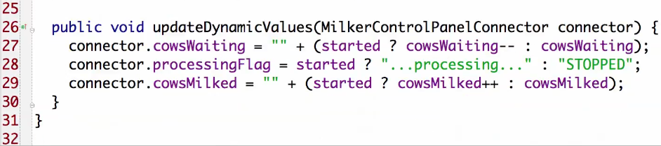

# Episode 23. Mocking Part 1
## Overview
mocking library를 자주 사용하지 않는다고 함.
## Boundaries and Mocks


- user가 login하면 controller가 user name과 password를 간단한 DS(LoginRequest)에 담아서 LoginInteractor에 전달한다.
- LoginInteractor는 user name과 password를 가지고 authorizer를 통해 확인한다.
- Authorizer가 user를 accept하면 Authorizer는 valid user id를 반환한다.
- LoginInteractor는 UserGateway를 사용해서 User 비즈니즈 객체를 fetch하고, 마지막 로그인 시간, 로그인 횟수 등을 얻는다.
- LoginInteractor는 이러한 데이터를 또 다른 단순한 DS(LoginResponse)를 통해 LoginPresenter에 전달한다.
- LoginPresenter는 화면에 보일 데이터를 준비한다.

### LoginInteractor에 대한 자동화 테스트를 어떻게 만들 것인가 ?
다음과 같이 쉽게 자동화된 테스트를 만들 수 있다고 한다.

- setup에서 User를 생성. username, password를 부여
- user record를 수정하여 last login time과 login 횟수를 갖도록 한다.

이와 같이 DB를 사용하면 테스트가 느려진다. 그리고 웹의 경우는 HTML을 긁어서 결과를 확인해야 할 수도 있다. UI를 변경할 때마다 테스트가 깨지게 된다. 또 테스트를 웹서버에서 수행해야만 한다. 이건 정말 느리다. 차라리 수동 테스트를 하는게 낫다.

Mocking을 이용하면 해소된다. DB에 연결할 필요도 없고, 웹서버를 사용할 필요도 없다. 또 HTML을 긁어서 확인할 필요도 없다. mocking이 수월하도록 nice clean decoupled 아키텍쳐를 만들어야 한다.

위 그림에서 빨간선 내부에 Interactor와 Interactor가 자신의 일을 수행하기 위해 호출해야 하는 모든 인터페이스가 존재한다. 이 인터페이스의 구현체들은 authorizing, DB access, presentation 등의 기능을 수행한다. 테스트할 때는 이러한 구현체를 사용할 필요가 없다. 다른 구현체를 사용할 수 있다. 테스트를 돕는 구현체... 이것이 **Mocking**이다.

테스트에서 개별적으로 원하는 결과를 반환하도록 하기 위해 stub을 생성한다.

- UserId(1)을 반환하는 StubAuthorizer
- InvalidUserID를 반환하는 RejectingAuthorizerStub

등을 만들어 놓고 테스트 케이스마다 적절한 구현체를 사용하면 된다.

`LoginInteractorImpl`에 setAuthorizer, setUserGateway는 있고, 이들에 대한 stub이 필요하지만 presenter는 다르다고 한다. presenter에 대해서는 적절한 시기에 적절한 메소드가 호출되었는지만 확인하면 된다. - interactor의 presenter에 대한 relationship을 spy하기 원한다.

- stub은 원하는 결과를 반환하도록 설정 가능
- spy는 추가적으로 어떤 인자를 전달받았는지를 저장했다가 전달받은 인자를 assert할 수 있음.

## Test Doubles


## The Dummy
가장 단순한 테스트 더블. interface에 있는 모든 메소드를 do nothing으로 구현하는 객체가 Dummy. 리턴하는 값이 필요하다면 대개 null이나 0을 반환

```
public class HourlyReportInteractor {
  public void generateReport(Date reportDate, Session session) {
    if (!isValidReportDate(reportDate))
      throw new InvalidDate();
    //...
  }
```

위 코드를 테스트하려고 한다.

```
  @Test(expected = HourlyReportInteractor.InvalidDate.class)
  public void testInvalidDate() throws Exception {
    Date reportDate = null;
    Session session = new DummySession();
    interactor.generateReport(reportDate, session);
  }
```

DummySession
- Session은 생성하기 어려운 객체이다.
- reportDate가 invalid한 경우 session은 사용되지도 않는다.
- DummySession을 이용한다(모든 method에서 `return null`)
- 이런 경우 Dummy가 효율적이다.

테스트하려는 메소드가 인자를 갖는데 테스트나 테스트되는 함수가 인자와 무관할 때 사용한다.

Dummy는 테스트 더블의 일종으로 어떤 액션도 취하지 않는 함수들로 이뤄진다.

## The Stub
stub은 dummy의 일종이나 null, 0을 반환하는 대신 특정 테스트가 요구하는 값을 반환한다.

stub은 dummy이다. 함수에서 어떤 일도 하지 않는다. 하지만 0이나 null 대신 어떤 요구되는 고정된 특별한 값을 반환한다. 아무것도 하지 않지만 당신이 원하는 값을 반환한다.

stub은 특정 경로로 테스트가 수행되도록 할 때 사용된다.

login interactor의 경우 사용자가 잘못된 패스워드를 입력했을 때의 행위를 어떻게 테스트할 것인가 ? authenticator를 stub해서 false를 반환하도록 하여 interactor가 올바른 행위를 하는지를 확인할 수 있다.

테스트와 stub 간에는 대응 관계가 존재한다. 테스트는 적절한 경로로 수행되도록 하는 stub를 선택하도록 작성된다. 올바른 패스워드로 login이 성공하는지 조사하는 테스트는 true를 반환하는 stub을 사용하고, 잘못된 패스워드를 처리하는 login을 조사하는 테스트는 false를 반환하는 stub을 사용한다.

## The Spy
spy는 stub이다. spy는 자신이 호출된 특별한 fact를 기억하고, 후에 테스트에 이러한 fact를 보고한다.

- 어떤 함수가 호출되었는지
- 그 함수가 언제 호출되었는지
- 몇번이나 호출되었는지
- 어떤 인자가 전달되었는지

를 알려줄 수 있다.

production 코드가 외부 서비스를 적절하게 호출하였는지 테스트하고자 할 때 유용한 기법이다.

## The Mock

Mock은 Spy이고 추가적으로

- 테스트에 유용한 값을 반환하고
- 호출된 fact들에 대해서 기억한다.
- 어떤 일이 일어나야 하는지를 아는 Spy이다.

## The Fake
마지막 테스트 더블은 Fake이다. Fake는 dummy도 stub도 spy도 mock도 아닌 Simulator이다.

실세계 객체가 하는 것 처럼 입력에 따라 다른 응답을 한다.

fake가 많아지면 복잡해지고 유지보수하기 어려워진다. Test에서 필요한 fake만 작성하도록 한다.

**avoid fakes when you can**

단위 테스트에서는 fake까지 필요한 경우는 드물다. 하지만 integration test에서는 fake가 유용한 경우가 많다.

# Episode 23. Mocking Part 2

## Behavior vs State


32bit x 32bit에 대한 테스트를 어떻게 추가할 것인가 ? 64bit의 조합을 다 조사해야 하는가 ? 엄청난 시간이 소요될 것이다.

**spy on the algorithm**

3 x 4 = 12에 대해서 3+3+3+3=12로 계산되므로 add가 3을 인자로 4번 호출되었는지를 확인하면 된다.


---


---


---


---

mock 기반 테스트는 DIP 적용되었을 때 적합. 하지만 Test가 구현에 종속된다는 문제가 발생.

따라서 적합한 방법을 택해야한다.

## Mocking Pattern

### Test Specific Subclass


subclass & override와 유사한 개념인듯

### Self Shunt


테스트 클래스가 인터페이스의 구현체가 되는 것

### Humble Object


테스트하기 어려운 boundary에 대해 보다 테스트하기 용이하도록 하기 위해 적용한다.


PumpRegister는 테스트하기 어려운 코드이다. engage가 테스트하려는 알고리즘이고, setPumpSpeed, sleep는 override 가능하다.


테스트하기 어려운 코드와 테스트해야 하는 코드를 isolate시켰다. 테스트하기 어려운 코드는 인터페이스(PumpRegister) 뒤에 숨어 있다. 이 인터페이스가 Humble이다.

DI를 적용하여 테스트 불가한 코드가 테스트 가능한 코드에 의존성을 갖도록한다. 테스트하기 어려운 어떠한 boundary에도 이 방법을 적용할 수 있다. ex. GUI Boundary


milking cows process는 GUI랑 무관하다. GUI는 테스트하기 어려우니 GUI와 process를 분리하고자 한다. GUI를 Humble로 만들고자 한다. GUI를 테스트할 때는 fake process를 이용한다.

#### GUI Example

##### MilkerControlPanel.java


GUI에 있는 대부분의 코드는 static code이다. milking process에 관련된 코드는 없다. 모든 코드는 그저 단순한 프리젠테이션 코드이다.

startButton.addActionListener, stopButton.addActionListener만이 의미있는 객체의 메소드 호출을 한다. connector#startButtonClicked, connector#stopButton

setStaticLabels도 connector를 사용.

##### MilkerControlPanelConnector


connector가 process를 갖는다. startButton이 눌리면 process를 start하고 stopButton이 눌리면 process를 stop한다. 이게 버튼이 process에 참여하는 방법이다.

static, dynamic public variable들을 갖는다.

loadStaticVariables, updateDynamicValues가 process에서 connector로 값을 가져오는 함수들이다.

##### MilerProcess


MilkerProcess가 인터페이스이고 이를 통해 DI가 일어난다. non humble side는 인터페이스 뒤에 있고, humble side는 interface 앞에 있다.

##### MilkerProcessImpl




GUI를 테스트하기 위한 fake process 구현체

fake process를 통해 GUI를 테스트할 수 있다. GUI는 충분히 humble해서 눈으로 보면서 테스트할 수 있다. 실제로 GUI를 실행하고 눈으로 확인하면서 테스트.

이 프로그램에서 흥미있는 것은 **milking process와 swing code의 isolation**이다.

## Mocking Frameworks

mocking framework를 쓸때 mockito, easymock, jmock 등을 사용하지만 솔직히 mocking framework를 잘 사용하지 않는다.

TDD에서 mocking framework이 필수적인 것 처럼 이야기하지 않나 ? 안다. 대부분의 사람들이 사용하기를 좋아한다. 하지만 나는 대개 사용하지 않는다.

왜 ?

### mock은 작성하기 쉽다.


- IDE에서 `implement interface`를 선택. 그러면 Dummy는 바로 나온다. 
- Stubbing 하려면 약간의 코드를 작성하면 된다. 
- Spying하려면 함수가 호출되었는지를 저장할 수 있는 약간의 코드를 추가하면 된다.
- Mocking을 하는 것도 약간의 코드를 추가하면 된다.

Framework이 굳이 필요하지 않다. 거기다가 Mock을 수작업으로 작성하면 테스트의 가독성을 보다 증대할 수 있는 좋은 이름을 부여할 수도 있다. 그리고 다른 테스트에서 그 Mock을 재사용할 수도 있다. 그래서 Mock을 수작업으로 작성하는 것이 더 의미가 크다.

`setUp에서 Mock의 행위를 기술하는 것이 더 좋지 않은가 ?`

사실 그렇게 생각하지 않는다. 그게 별로 가독성이 좋지 않다고 생각한다.


mock framework이 나쁘다는 것이 아니라 mock을 작성하는 것은 정말 쉬워서 가독성을 높이기 위해 직접 작성하는 것이 더 좋다는 것이다.

가끔은 사용한다고 했지 않은가 ? 언제 사용하나 ?

사용해야만 할 때 사용한다. mocking tool은 매우 강력하다. shielded 된 final interface를 override하거나, private variable/function을 access하거나... 이런 경우에는 mocking tool이 매우 유용하다.

하지만 잘 설계된 시스템에서는 그런 강력한 기능은 거의 필요치 않다. 하지만 쓰레기 더미 같은 레거시 시스템에서는 그러한 강력한 기능이 매우 유용하다.